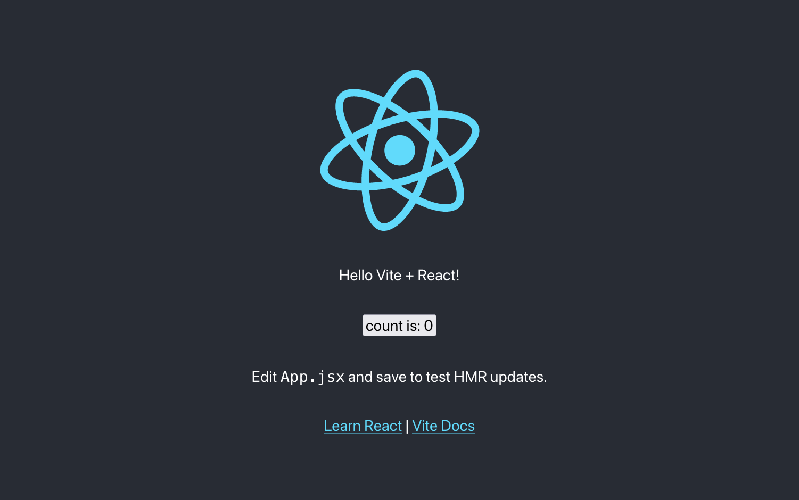
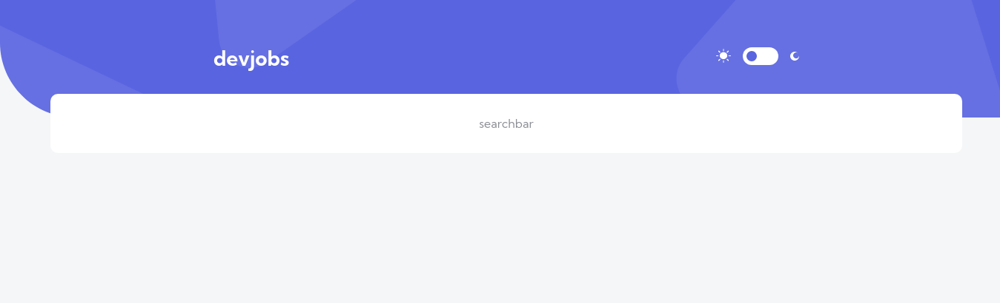
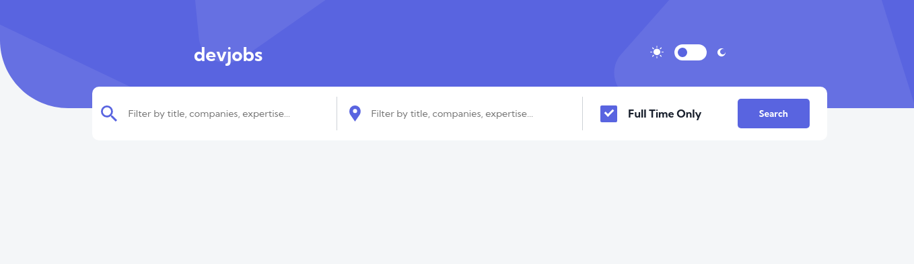
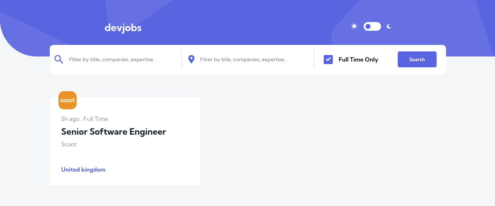
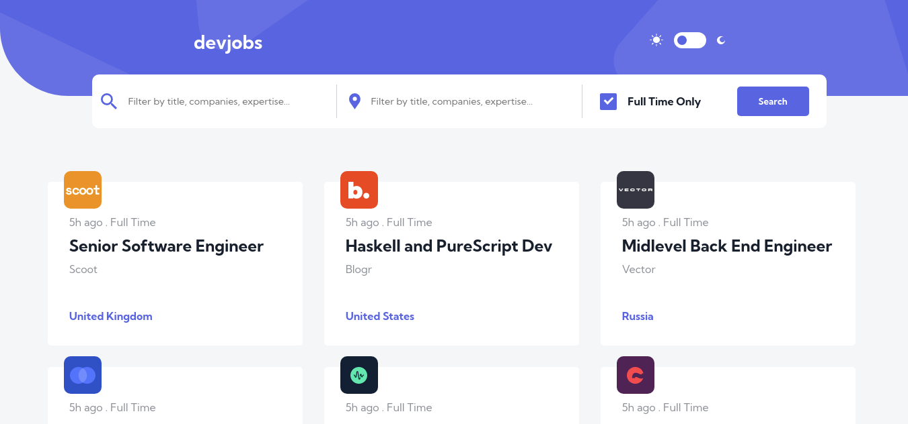
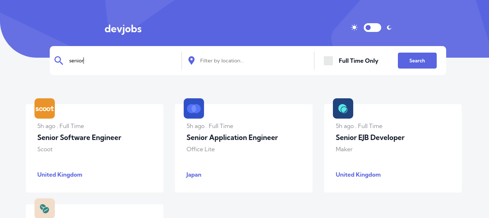
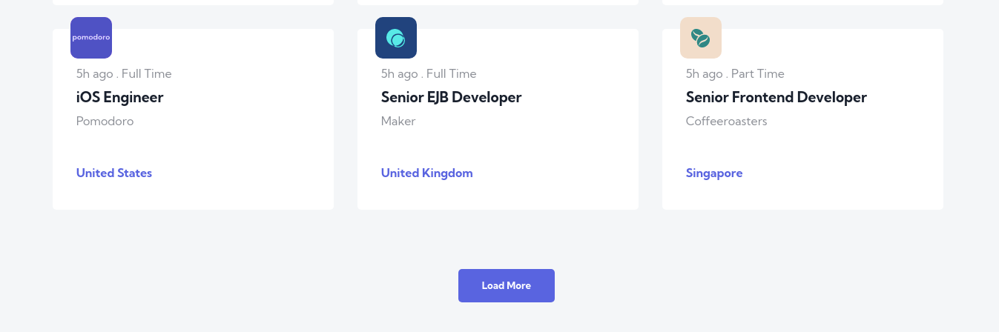

# Frontend Mentor - Devjobs web app solution

This is a solution to the [Devjobs web app challenge on Frontend Mentor](https://www.frontendmentor.io/challenges/devjobs-web-app-HuvC_LP4l). Frontend Mentor challenges help you improve your coding skills by building realistic projects.

## Table of contents

- [Overview](#overview)
  -[Installation](#installation)
  - [The challenge](#the-challenge)
  - [Screenshots](#screenshots)
  - [Links](#links)
  - [Built with](#built-with)
- [Author](#author)
## Overview

## Installation
1. Clone the repo
   ```sh
   git clone https://github.com/igaimerca/devjobs-challenge.git
   ```
1. Install dependencies
   ```sh
   yarn install
   ```
1. Run in development mode
   ```sh
   yarn start
   ```


### The challenge

Users should be able to:

- View the optimal layout for each page depending on their device's screen size
- See hover states for all interactive elements throughout the site
- Be able to filter jobs on the index page by title, location, and whether a job is for a full-time position
- Be able to click a job from the index page so that they can read more information and apply for the job
- **Bonus**: Have the correct color scheme chosen for them based on their computer preferences. _Hint_: Research `prefers-color-scheme` in CSS.

### Screenshots

##### 2ac3396 Initialized the project 
##### 223675e Added Header 
##### a6d76f6 Added a search bar container 
##### ce566cf Added search filters and submit button 
##### 9619b32 Added job card 
##### eabea94 Added all jobs 
##### 11e0c11 Worked on search jobs logic 
##### 38e60c9 Added load more functionality 
##### 7bc5dfa Added get current job logic 

### Links

- Solution URL: [Github ](https://github.com/igaimerca/devjobs-challenge)
- Live Site URL: [Vercel](https://devjobs-challenge.vercel.app)

### Built with

- Semantic HTML5 markup
- CSS custom properties
- Flexbox
- CSS Grid
- Mobile-first workflow
- [React](https://reactjs.org/) - JS library
- [Sass](https://sass-lang.com/) - For styles

## Author

- Twitter - [@AimeIgirimpuhwe](https://www.twitter.com/aimeigirimpuhwe)
